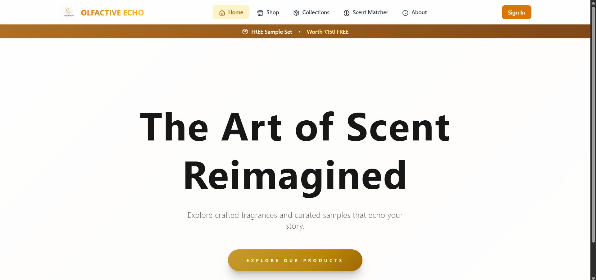
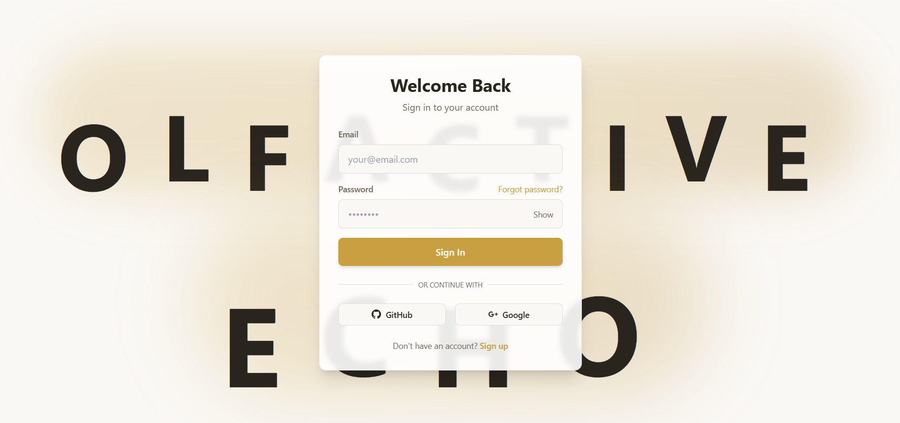
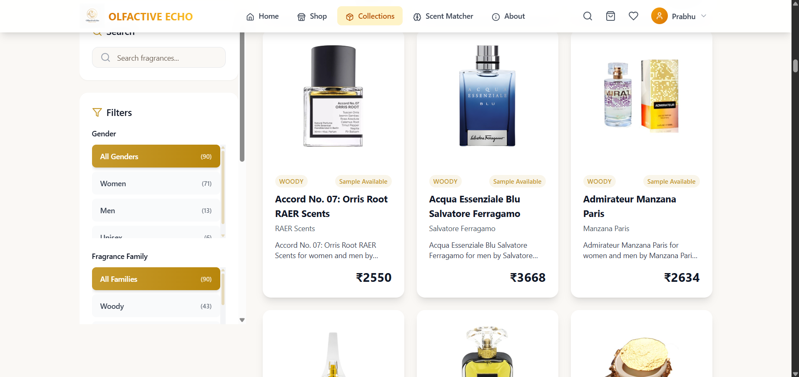
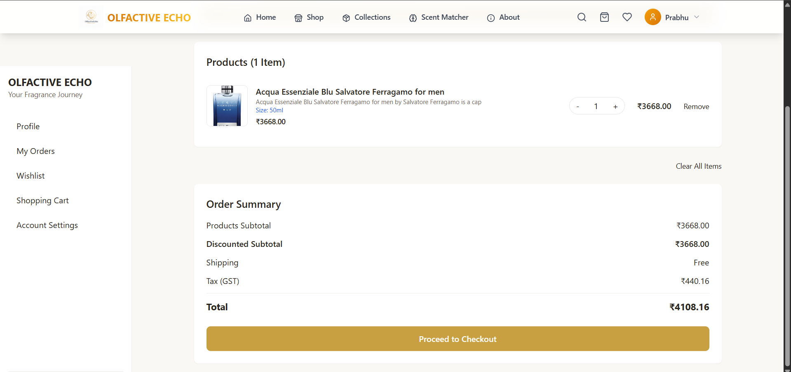
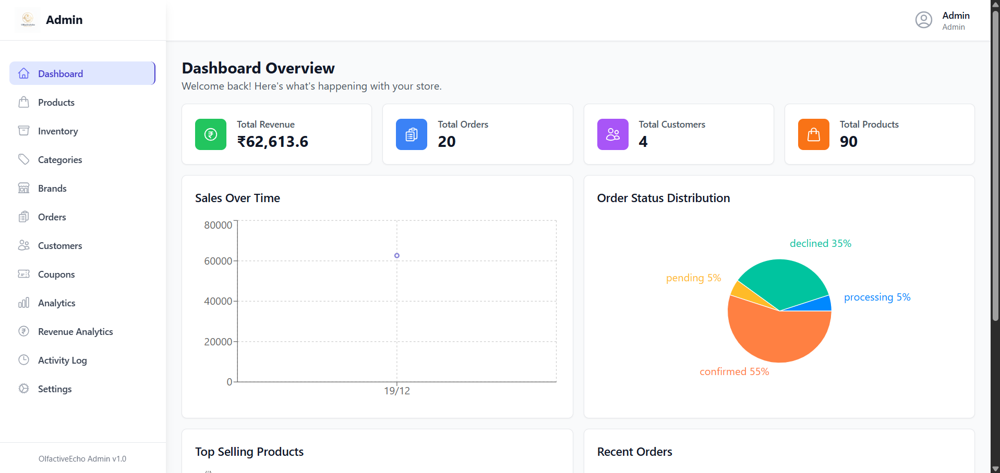
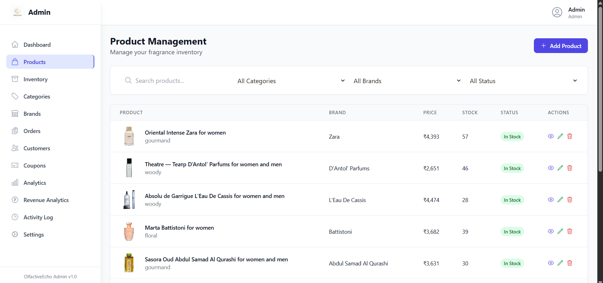
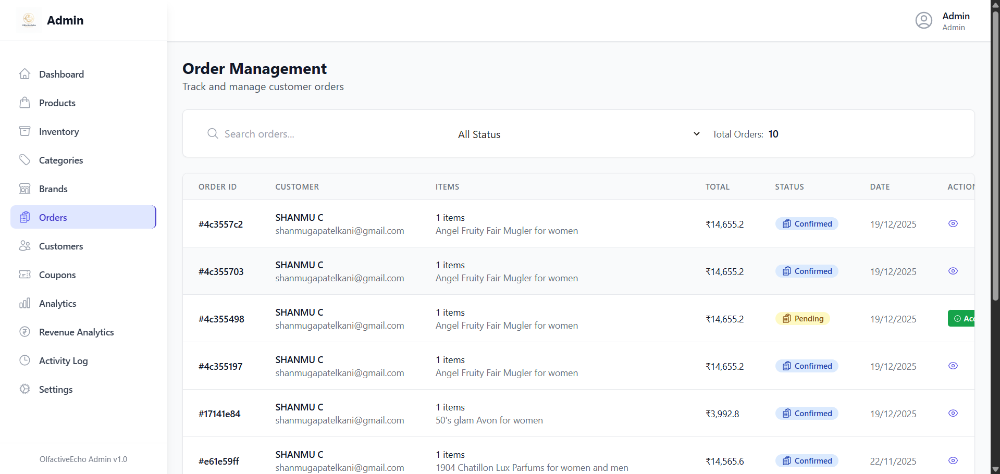
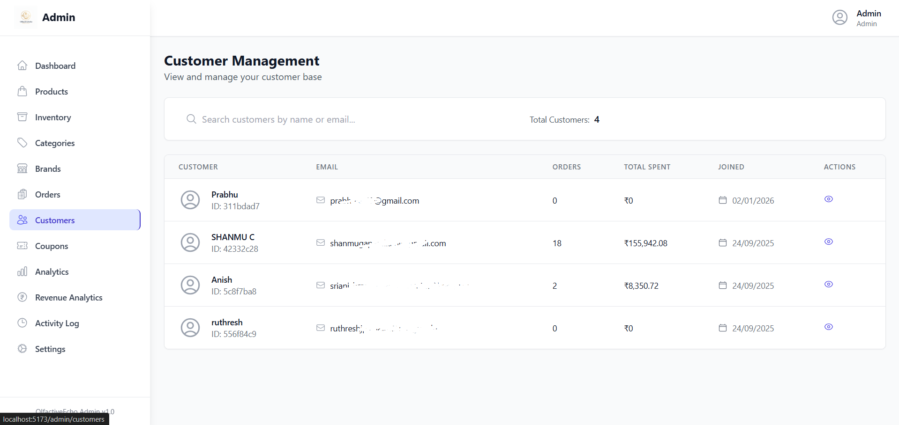

# OlfactiveEcho

A full-stack luxury perfume e-commerce platform with AI-powered recommendations, multi-channel notifications, and comprehensive admin management.

## 📸 Demo

### Home Page


### Login Page


### Products


### Shopping Cart


### Admin Dashboard





## ✨ Features

**Customer**
- Product catalog with advanced filtering
- AI-powered fragrance recommendations (Gemini AI)
- Shopping cart & wishlist
- Order tracking & history
- Multi-channel notifications (Email, SMS, WhatsApp)

**Admin**
- Product, brand, and category management
- Order processing & user management
- Revenue analytics & activity logs
- Coupon system

## 🚀 Quick Start

### Prerequisites
- Node.js v16+
- MongoDB (local or [Atlas](https://www.mongodb.com/cloud/atlas))

### Installation

```bash
# Clone repository
git clone https://github.com/anish-off/OlfactiveEcho.git
cd OlfactiveEcho

# Backend setup
cd backend
npm install
cp .env.example .env  # Configure your .env
npm run seed          # Populate database (REQUIRED)
npm run dev

# Frontend setup (new terminal)
cd frontend
npm install
npm run dev
```

### Access
- Frontend: http://localhost:5173
- Backend: http://localhost:5000
- Admin: `admin@olfactiveecho.com` / `AdminPass123!`

## ⚙️ Configuration

Create `backend/.env`:

```env
# Required
MONGODB_URI=mongodb://localhost:27017/olfactiveecho
JWT_SECRET=your-secret-key
PORT=5000

# Optional
EMAIL_USER=your-email@gmail.com
EMAIL_PASS=your-app-password
TWILIO_ACCOUNT_SID=your-sid
TWILIO_AUTH_TOKEN=your-token
GEMINI_API_KEY=your-key
```

## 🛠 Tech Stack

**Frontend:** React 19, Vite, Tailwind CSS, Framer Motion  
**Backend:** Node.js, Express 5, MongoDB, Mongoose  
**Auth:** JWT, Bcrypt  
**Services:** Nodemailer, Twilio, Cloudinary, Gemini AI

## 📁 Structure

```
├── backend/
│   ├── controllers/    # Request handlers
│   ├── models/         # MongoDB schemas
│   ├── routes/         # API routes
│   ├── middleware/     # Auth & validation
│   └── services/       # External services
└── frontend/
    └── src/
        ├── components/ # UI components
        ├── pages/      # Application pages
        └── api/        # API integration
```

## 🔐 Security

- JWT authentication
- Password hashing (bcrypt)
- Input validation & sanitization
- CORS protection
- Rate limiting

## 🤝 Contributing

Fork → Feature Branch → Pull Request

## 👤 Author

**Anish** - [@anish-off](https://github.com/anish-off)

---

Built with ❤️ for fragrance enthusiasts
